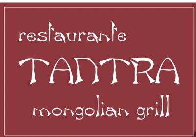
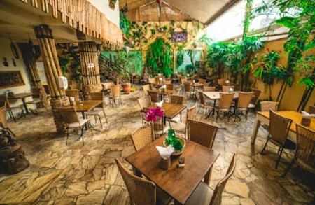
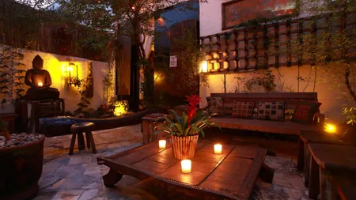
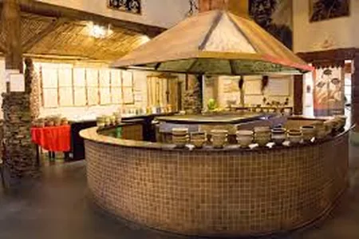
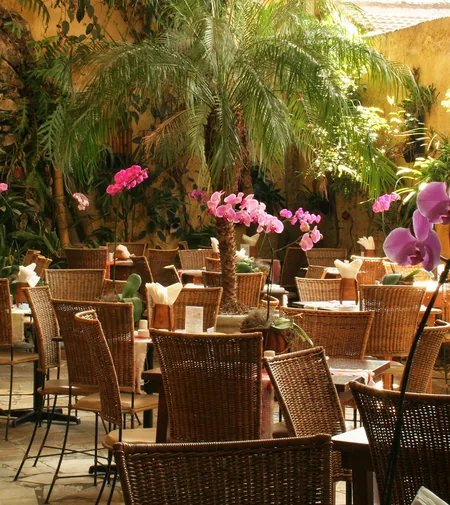
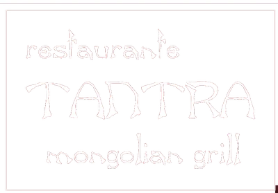

<!doctype html>
<html lang="pt-BR">
<head>
  <meta charset="utf-8" />
  <meta name="viewport" content="width=device-width, initial-scale=1" />
  <title>Palestra Gratuita para Times de Vendas | Tantra Restaurante</title>
  <meta name="description" content="Palestra gratuita (10h–11h30) para Diretores e Gerentes comerciais levarem seu time. Como criar uma experiência tão boa que o cliente não esquece, volta e indica." />

  <!-- FAVICON (arquivos no ROOT) -->
  <link rel="icon" href="favicon.ico" sizes="any">
  <link rel="icon" type="image/png" href="favicon-32.png" sizes="32x32">
  <link rel="icon" type="image/png" href="favicon-192.png" sizes="192x192">
  <link rel="apple-touch-icon" href="favicon-180.png">
  <meta name="theme-color" content="#0b0a08">

  <meta property="og:title" content="Palestra Gratuita para Times de Vendas | Tantra" />
  <meta property="og:description" content="Como criar uma experiência tão boa que o cliente não esquece, volta e indica. 10h–11h30. Vagas limitadas." />
  <meta property="og:type" content="website" />

  
</head>

<body>
  <!-- Header -->
  

    

      

        
      

      <nav class="nav" aria-label="Navegação">
        <a href="#inscricao">Inscrição</a>
        <a href="#como-funciona">Como funciona</a>
        <a href="#conteudo">Conteúdo</a>
        <a href="#galeria">Galeria</a>
        <a href="#local">Local</a>
      </nav>

      <a class="btn btn-primary" href="#inscricao">Reservar vaga</a>
    

  

  <!-- Hero -->
  <header class="hero">
    

      

        
 Encontro gratuito • 10h–11h30 • Times comerciais

        <h1>Como fazer o cliente não esquecer da sua empresa</h1>
        

          Uma palestra prática para <strong>Diretores e Gerentes Comerciais</strong> levarem seu time
          e aprenderem como criar uma experiência que gera <strong>lembrança, retorno e indicação</strong>.
        

        

          <a class="btn btn-primary" href="#inscricao">Quero levar meu time</a>
          <a class="btn" href="#conteudo">Ver conteúdo</a>
        

        

          

✓

<strong style="color:var(--text)">Retenção</strong> Menos cliente “one-shot” e mais recorrência.

          

✓

<strong style="color:var(--text)">Indicação</strong> Experiência memorável vira conversa e recomendação.

          

✓

<strong style="color:var(--text)">Valor percebido</strong> Menos disputa por preço, mais preferência.

          

✓

<strong style="color:var(--text)">Aplicável</strong> Ideias práticas para o dia a dia do vendedor.

        

        
* Vagas limitadas por data para manter a experiência focada (times pequenos funcionam melhor).

      

      <!-- Form (logo no início do site) -->
      

        
Inscreva sua empresa (gratuito)

        
Preencha abaixo para reservar a vaga do seu time. Você recebe confirmação por WhatsApp.

        <form id="leadForm" action="https://formspree.io/f/mzdvqaen" method="POST">
          

            

              <label for="nome">Nome</label>
              <input id="nome" name="nome" placeholder="Seu nome" required />
            

            

              <label for="cargo">Cargo</label>
              <input id="cargo" name="cargo" placeholder="Diretor/Gerente Comercial" required />
            

          

          

            

              <label for="empresa">Empresa</label>
              <input id="empresa" name="empresa" placeholder="Nome da empresa" required />
            

            

              <label for="tamanho_time">Quantas pessoas?</label>
              <select id="tamanho_time" name="tamanho_time" required>
                <option value="" disabled selected>Selecione</option>
                <option>3 a 5</option>
                <option>6 a 10</option>
                <option>11 a 15</option>
                <option>16+</option>
              </select>
            

          

          

            

              <label for="whats">WhatsApp (com DDD)</label>
              <input id="whats" name="whats" placeholder="(11) 9xxxx-xxxx" required />
            

            

              <label for="email">E-mail corporativo</label>
              <input id="email" name="email" type="email" placeholder="voce@empresa.com" required />
            

          

          

            

              <label for="data">Data desejada</label>
              <select id="data" name="data" required>
                <option value="" disabled selected>Escolha uma data</option>
                <option>Próxima Semana (a combinar)</option>
                <option>Quinzenal (a combinar)</option>
                <option>Outra (informar abaixo)</option>
              </select>
            

            

              <label for="horario">Horário</label>
              <input id="horario" name="horario" value="10:00 – 11:30" readonly />
            

          

          

            <label for="observacoes">Observações (opcional)</label>
            <textarea id="observacoes" name="observacoes" placeholder="Ex.: queremos focar em retenção, indicação, pós-venda, etc."></textarea>
          

          <input type="hidden" id="page_url" name="page_url" value="">
          <input type="hidden" name="_subject" value="Nova inscrição - Palestra Tantra (Time de Vendas)">

          <button class="btn btn-primary" type="submit">Enviar inscrição</button>

          
Ao enviar, sua empresa entra na lista de confirmação. O Eric confirma os detalhes por WhatsApp.

        </form>
      

    

  </header>

  <!-- Como funciona -->
  <section id="como-funciona">
    

      <h2 class="section-title">Como funciona</h2>
      

        

          <h3>1) Você inscreve sua empresa</h3>
          
Escolhe o tamanho do time e indica a melhor data (semanal/quinzenal). A inscrição é gratuita.

        

        

          <h3>2) Confirmação por WhatsApp</h3>
          
Após o cadastro, o Eric entra em contato para confirmar e alinhar os detalhes do encontro.

        

        

          <h3>3) Palestra prática (10h–11h30)</h3>
          
Conteúdo aplicável para vendas: como criar experiência que fixa a marca e aumenta recorrência/indicação.

        

      

    

  </section>

  <!-- Conteúdo -->
  <section id="conteudo">
    

      

        <h2 class="section-title">O que seu time vai levar</h2>
        
<strong>Experiência</strong> que vira lembrança

        
<strong>Percepção de valor</strong> sem desconto

        
<strong>Fidelização</strong> e retorno

        
<strong>Indicação</strong> e boca a boca

        

          O cliente pode esquecer a proposta, mas raramente esquece como você fez ele se sentir.
          A palestra mostra como desenhar isso na prática.
        

      

      

        <h2 class="section-title">Agenda do encontro</h2>
        
Formato pensado para times comerciais (dinâmico e direto).

        
<strong>10:00</strong> • Abertura e contexto

        
<strong>10:15</strong> • Método: “inesquecível por design”

        
<strong>10:45</strong> • Exemplos aplicáveis para vendas

        
<strong>11:10</strong> • Perguntas e próximos passos

        
* Duração total: 1h30. Sem venda no meio. Só conteúdo e prática.

      

    

  </section>

  <!-- Galeria -->
  <section id="galeria">
    

      <h2 class="section-title">Galeria • O clima do Tantra</h2>
      
Clique nas fotos para ampliar.

      

        

Ambiente

        

Chapa

        

Jardim

        

Prato

        

Salão

        

Buffet

        

Bar

        

Lounge

      

    

  </section>

  <!-- Local -->
  <section id="local">
    

      

        <h2 class="section-title">Local</h2>
        

          <strong>Tantra Restaurante</strong> 
          Vila Olímpia • São Paulo
        

        
* Após a inscrição, a confirmação e detalhes chegam pelo WhatsApp.

      

      

        <h2 class="section-title">Perguntas rápidas</h2>
        
<strong>Quanto custa?</strong> É gratuito.

        
<strong>Quantas pessoas?</strong> Recomendado de 5 a 15 (pode variar).

        
<strong>Tem apresentação comercial?</strong> Não. O foco é conteúdo e experiência.

        
<strong>Como escolho a data?</strong> Você sinaliza no formulário e confirmamos por WhatsApp.

      

    

  </section>

  <footer>
    

      

        
        
©  • Página de inscrição (palestra gratuita)

      

      

        Dúvidas? Clique no WhatsApp e fale direto com o Eric.
          
        <a class="btn" href="#inscricao">Voltar para inscrição</a>
      

    

  </footer>

  

  <!-- Lightbox -->
  

    

      <button class="lb-close" id="lbClose" aria-label="Fechar">✕</button>
      
    

  

  <!-- Whats -->
  
Fale com o Eric no WhatsApp

  

  
</body>
</html>

